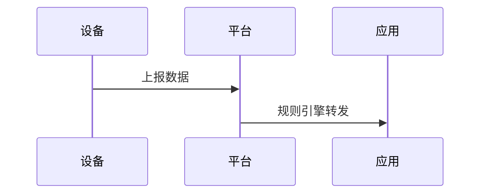

# 模板 B：平台分析型

> 适用：横向对照多个平台/厂商的同一类能力（如 iot-platform-design 系列）

---

## 系列组织

```
{series-slug}/
├── index.md              # 对照总表 + 各厂商入口
├── {vendor-a}/
│   ├── 01-为什么需要XX.md
│   ├── 02-稳定连接.md
│   ├── 03-消息与规则引擎.md
│   └── ...
├── {vendor-b}/
│   └── ...（同编号同主题，便于横向对照）
```

**关键设计：各厂商使用相同编号 → 读者可跨厂商读同一编号进行对照。**

---

## 文章结构

```markdown
# {厂商名} · {主题}

> 技术栈：{本篇涉及的关键技术}
> 适用场景：{一句话}

## 0 {动态标题}

{2-3 段引入：为什么这个主题重要 / 本篇在系列中的位置}

{可选：一张总览 SVG}


## 1 问题背景：{具体痛点}

{这个主题要解决什么问题}

- **痛点一**：{描述}
- **痛点二**：{描述}
- **痛点三**：{描述}

## 2 设计理念：{该平台的设计选择}

| 维度 | 自建 | 该平台方案 |
|------|------|-----------|
| {维度1} | {自建做法} | {平台做法} |
| {维度2} | {自建做法} | {平台做法} |

### 2.1 {核心机制一}

{解释 + 代码/配置示例}

### 2.2 {核心机制二}

{解释}

## 3 实际应用：{产品/服务矩阵}

{列出该平台的具体产品/服务，说明各自职责}



## 4 注意事项

- {限制/坑点/版本差异}

## 5 小结

{2-3 句话总结本篇核心 takeaway}

## 参考链接

- [官方文档](URL)
- [API 参考](URL)
```

---

## index.md 对照表（系列首页核心）

```markdown
| 共性主题 | 共同要解决的问题 | 跨厂商异构看点 |
| :--- | :--- | :--- |
| {主题1} | {通用问题} | {各家差异} |
| {主题2} | {通用问题} | {各家差异} |
```

---

## 配图要求

| 位置 | 类型 | 内容 |
|------|------|------|
| 开头或 §2 | SVG | 该平台针对本篇主题的架构/数据流 |
| §3 内 | Mermaid | 消息流转 / 组件交互序列图 |
| 可选 | PNG 截图 | 控制台界面（如能访问） |

---

## 写作要点

- **同名异构**是核心卖点：同一主题，不同厂商怎么做
- 不贬低任何厂商，只描述各自设计选择
- 对比表格是最有效的表达方式
- 每篇开头点明"本篇在系列中的位置"
- 子目录按厂商分，图片也按厂商分子目录
